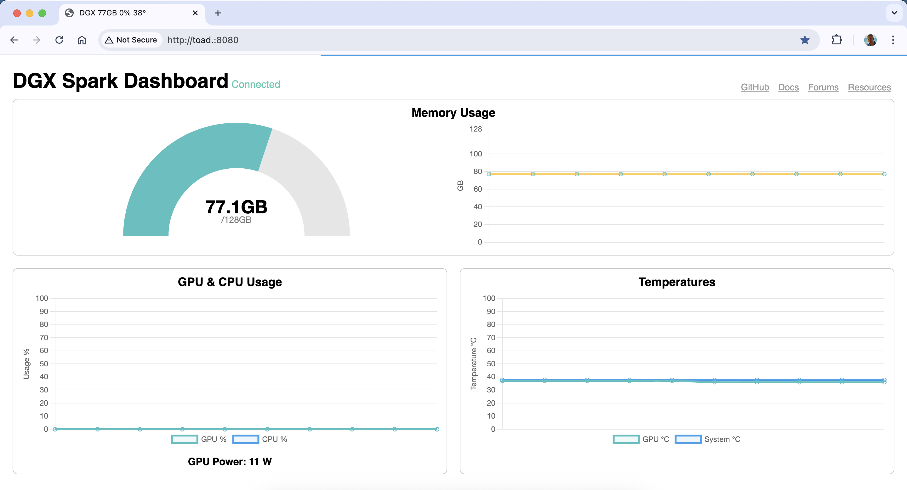

# DGX Spark Dashboard

A simple dashboard for the DGX Spark with some slight differences to the built-in dashboard:

- Binds to `0.0.0.0` so it can be accessed over the network without an SSH tunnel
- Uses `MemTotal` and `MemAvailable` for memory stats so that caches and buffers don't appear as consumed memory
- Includes GPU power draw
- Includes CPU usage
- Includes GPU and system temperatures

Metrics update every 5s and are only collected while there is a connected client.

# Running

```
git clone https://github.com/DanTup/dgx_dashboard
cd dgx_dashboard
docker build -t dgx_dashboard .
docker run -d --gpus all -p 8080:8080 --restart=unless-stopped --name dashboard dgx_dashboard
``` 


